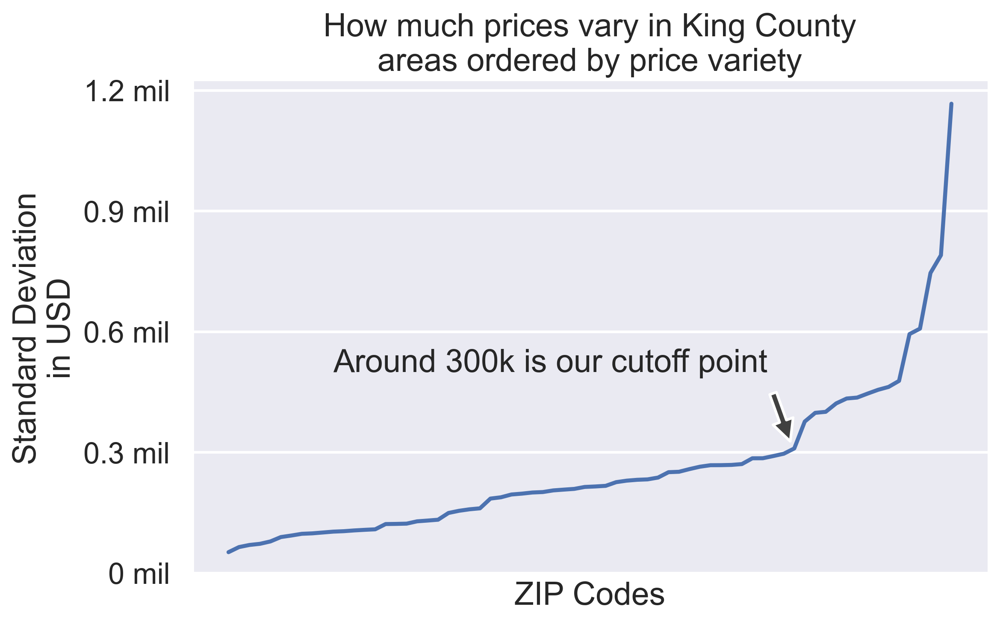

# Exploratory data analysis project

An exploratory data analysis project I did.

I cleaned and analyzed a dataset on house prices. I found and imported new data to make recommendations for the client's profile.

In the EDA notebook, check out my process to come up with recommendations for the client's profile.

In the presentation notebook you can see my stakeholder presentation.

### Some data viz




## Setup

```bash
pyenv local 3.11.3
    python -m venv .venv
    source .venv/bin/activate
    pip install --upgrade pip
    pip install -r requirements.txt
```
